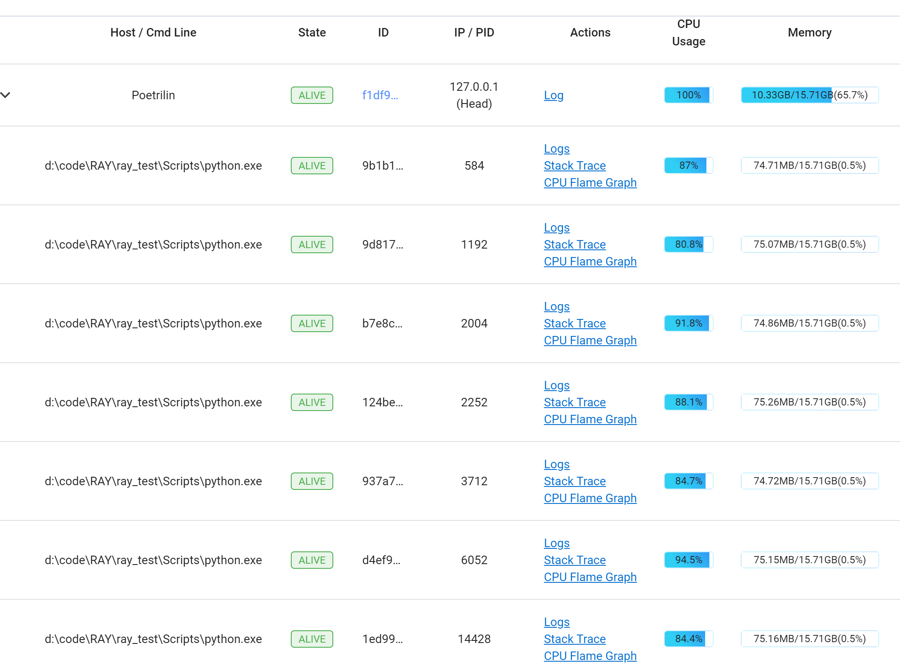
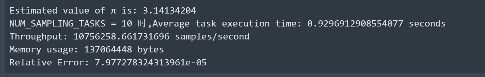
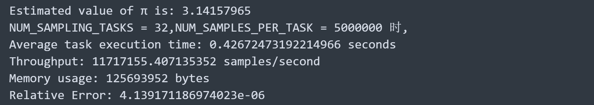

### 性能指标:

- 平均任务执行时间（Average Task Execution Time）：计算完成所有任务所需的平均时间。这个指标可以反映系统的整体性能。

- 吞吐量（Throughput）：表示单位时间内完成的任务数量。高吞吐量表示系统具有较高的并发处理能力。
  
- IOPS: 这个指标衡量单位时间内完成的输入/输出操作次数。对于涉及磁盘读写等操作的任务，高IOPS表示系统能够快速进行数据读写操作。
  
- 内存占用：通过监测程序的内存使用情况，可以评估系统的内存占用情况。对于内存密集型任务，了解系统的内存占用情况可以帮助确定系统的性能和资源利用情况。

- 网络带宽：可以使用Ray的Dashboard来监测集群的网络带宽使用情况，从而评估网络带宽的性能。评估网络带宽的性能可以帮助确定系统在分布式计算和通信过程中的效率和稳定性。

这些指标综合考虑了任务执行时间、并发处理能力、数据读写效率、资源利用情况以及网络通信性能，能够全面评估RAY框架的性能和效果。

我们测试的是吞吐量和平均任务执行时间,注意:

>吞吐量和平均执行时间的确都与任务的执行时间有关，但它们着重点不同，吞吐量关注的是任务的并发处理能力和每秒处理的样本数，而平均执行时间关注的是单个任务的执行速度。 虽然它们都与任务执行时间有关，但提供了不同的视角和衡量标准，可以在不同层面上评估系统的性能。

## 实际测试结果
性能监测
- Average task execution time:平均执行时间
- Throughput 单位时间吞吐量,描述并发程度
- Memory usage: 内存使用量
- Relative Error: 结果相对误差描述精度
  
(看初始与最后结果比较可以直接跳到最后)

初始:
如果直接将10 000 000个计算任务交给remote node并行计算开销也是非常长的,因为创建任务开销太大了(源码见[ray_raw.py](./ray_raw.py)),~~而且直接把限定内存跑炸了~~,不得不降低计算规模降了3个数量级才测试


考虑每个节点的task切换和调度需要花费一定的资源,于是将任务进行两次分组,一是指定分给一定的节点,二是对每个节点分配的任务(比如1_000_000)在进行100000个任务后再切换一次task_id,达到分层分块的效果.

重构后运行时查看dashboard可以观察到多个任务节点都在高CPU usage地计算



重构代码具体性能测试如下:


```shell
NUM_SAMPLING_TASKS = 10 时,Average task execution time: 0.9296912908554077 seconds
Throughput: 10756258.661731696 samples/second
Memory usage: 137064448 bytes
Relative Error: 7.977278324313961e-05
```

调整

```shell
NUM_SAMPLING_TASKS = 32 时,Average task execution time: 0.8162466362118721 seconds
Throughput: 12251199.032695692 samples/second
Memory usage: 137764864 bytes
Relative Error: 2.5320408779255272e-05
```

分析:

仅调节参数`NUM_SAMPLING_TASKS`,(测试了10,16,24,32,其中最佳为32)

- 对吞吐量优化效果可能有一定阈值约1/6
- 对Average task execution time优化效果可能有一定阈值约1/9
  
进一步优化思路:

初始的想法是直接让工作节点并行一同计算,但是中间过长的运算导致调度任务困难,于是

再试着调节每个节点的任务数量, 即配置`NUM_SAMPLES_PER_TASK`,再次运行结果.

```shell
NUM_SAMPLING_TASKS = 16,NUM_SAMPLES_PER_TASK = 5000000 时,
Average task execution time: 0.4421846568584442 seconds
Throughput: 11307493.198708251 samples/second
Memory usage: 137510912 bytes
Relative Error: 5.1073963904789533e-05
```
```shell
NUM_SAMPLING_TASKS = 32 时,Average task execution time: 0.41309261322021484 seconds
Throughput: 12103823.307376737 samples/second
Memory usage: 136937472 bytes
Relative Error: 4.429396332914487e-05
```

### 结果分析

1. 改变参数对`Memory usage`的影响很小,几乎没有

2. 增大`NUM_SAMPLING_TASKS`,能提高吞吐量和平均运行效率,但有一定阈值,对本文初始配置来说约$\frac{1}{9}$~$\frac{1}{6}$.
   
3. 在2的基础上可以下调`NUM_SAMPLES_PER_TASK`显著提高平均运行效率(可以认为原来每个计算节点任务量较大,资源有限导致效率降低),但是吞吐量无明显变化

### 前后比较

- 重构任务代码后

初始参数部署


进一步调整分块参数后:



|                 | 初始部署  | 调整分块参数后  |
| --------------- | -------- | --------------|  
| 平均运行时间(s)  | 0.9296    | 0.4267        |
| 吞吐量(个/s)     | 1.07亿    | 1.17亿         |
| 内存占用(MB)     | 137      | 137          |

从运行时间上优化效率 $\eta =\frac{0.9296 -0.4267   }{0.9296} =54.09\%$