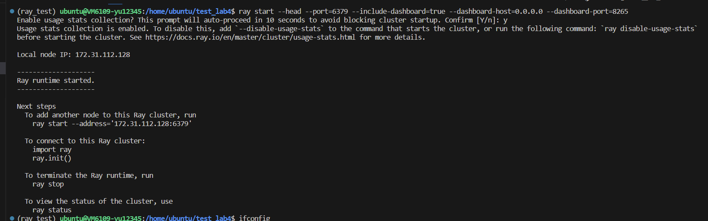
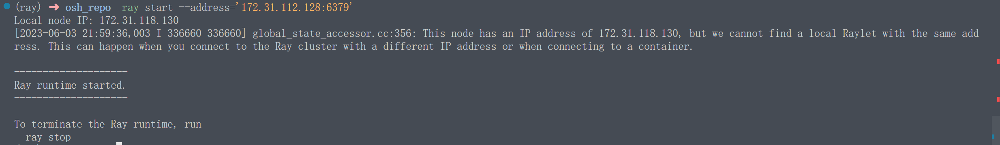
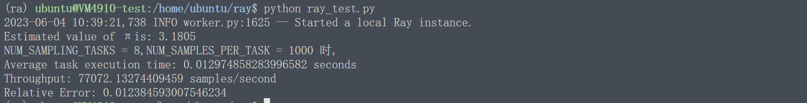
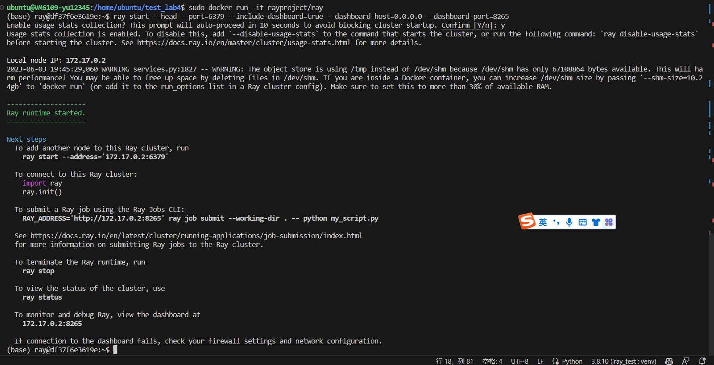
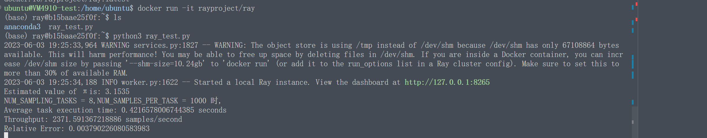

<style>
  #my-svg {
    width: 100px;
    height: 40px;
  }
</style>


<h1>部署文档---  RAY<svg  id="my-svg" viewBox="0 0 110 44" fill="none" xmlns="http://www.w3.org/2000/svg"><path d="M15.989 20.258a6.013 6.013 0 0 1 1.552-2.736 5.88 5.88 0 0 1 4.172-1.727c1.63 0 3.104.66 4.172 1.727a6.011 6.011 0 0 1 1.552 2.736h4.346a5.746 5.746 0 0 1 .66-1.592l-7.703-7.703a5.954 5.954 0 0 1-3.027.835 5.88 5.88 0 0 1-4.172-1.727 5.88 5.88 0 0 1-1.727-4.172c0-1.63.66-3.105 1.727-4.172A5.88 5.88 0 0 1 21.713 0c1.63 0 3.104.66 4.172 1.727a5.88 5.88 0 0 1 1.727 4.172 5.9 5.9 0 0 1-.835 3.027l7.703 7.703a5.954 5.954 0 0 1 3.028-.834c1.63 0 3.104.66 4.171 1.727a5.88 5.88 0 0 1 1.727 4.171 5.88 5.88 0 0 1-1.727 4.172 5.88 5.88 0 0 1-4.172 1.727 5.9 5.9 0 0 1-3.026-.834l-7.704 7.723c.524.892.835 1.92.835 3.026a5.88 5.88 0 0 1-1.727 4.172 5.88 5.88 0 0 1-4.172 1.727 5.88 5.88 0 0 1-4.172-1.727 5.88 5.88 0 0 1-1.727-4.172c0-1.63.66-3.104 1.727-4.171a5.88 5.88 0 0 1 4.172-1.727 5.9 5.9 0 0 1 3.027.834l7.703-7.703a5.746 5.746 0 0 1-.66-1.591h-4.346a6.011 6.011 0 0 1-1.552 2.736 5.88 5.88 0 0 1-4.172 1.727 5.88 5.88 0 0 1-4.172-1.727 6.013 6.013 0 0 1-1.552-2.736h-4.347a6.013 6.013 0 0 1-1.552 2.736 5.88 5.88 0 0 1-4.172 1.727 5.88 5.88 0 0 1-4.172-1.727A5.817 5.817 0 0 1 0 21.713c0-1.63.66-3.105 1.727-4.172a5.88 5.88 0 0 1 4.172-1.727c1.63 0 3.104.66 4.172 1.727a6.014 6.014 0 0 1 1.552 2.736h4.366v-.02Zm3.59 19.384c.543.543 1.3.892 2.134.892.834 0 1.59-.33 2.134-.892.543-.543.893-1.3.893-2.135 0-.834-.33-1.59-.893-2.134a3.022 3.022 0 0 0-2.134-.892c-.835 0-1.591.33-2.135.892a3.022 3.022 0 0 0-.892 2.135c0 .834.33 1.59.892 2.134Zm20.063-15.795c.543-.543.892-1.3.892-2.134 0-.835-.33-1.591-.892-2.135a3.022 3.022 0 0 0-2.135-.892c-.834 0-1.59.33-2.134.892a3.022 3.022 0 0 0-.892 2.135c0 .834.33 1.59.892 2.134.543.543 1.3.893 2.135.893a3.106 3.106 0 0 0 2.134-.893ZM23.847 3.764a3.022 3.022 0 0 0-2.134-.892c-.835 0-1.591.33-2.135.892a3.022 3.022 0 0 0-.892 2.135c0 .834.33 1.59.892 2.134.544.543 1.3.893 2.135.893.834 0 1.59-.33 2.134-.893.543-.543.893-1.3.893-2.134a3.106 3.106 0 0 0-.893-2.135ZM3.764 19.578a3.022 3.022 0 0 0-.892 2.135c0 .834.33 1.59.892 2.134.544.543 1.3.893 2.135.893.834 0 1.59-.33 2.134-.893.543-.563.893-1.3.893-2.134 0-.835-.33-1.591-.893-2.135-.563-.543-1.3-.892-2.134-.892-.835 0-1.591.33-2.135.892Zm15.814 0a3.022 3.022 0 0 0-.892 2.135c0 .834.33 1.59.892 2.134.544.543 1.3.893 2.135.893.834 0 1.59-.33 2.134-.893.543-.543.893-1.3.893-2.134 0-.835-.33-1.591-.893-2.135a3.022 3.022 0 0 0-2.134-.892c-.835 0-1.591.33-2.135.892Z" fill="#028CF0"></svg></h1>


## 单机版本
(以Ray最小依赖为例,如果想安装拓展版本请浏览[Ray官网](https://docs.ray.io/en/latest/index.html)再结合本文操作)

实际只要按照ray包就行`pip install ray`

如果你用虚拟环境的话(下面以virtualenv为例,Ubuntu: sudo apt install python3-virtualenv)
```shell
virtualenv ray_test
# 激活虚拟环境
# windows
.\ray_test\Scripts\activate
# linux的话改成
source ray_test/bin/activate

pip install ray
# 你也可以下载本仓库的requirements.txt文件后运行pip install -r requirements.txt
```
下面就可以调用ray了,在该环境下创建一个py文件
```
import ray
ray.init()
```
输出为下面即正确,注意提示,你可以访问本机的8265端口(http://127.0.0.1:8265/)进行RAY的调试与监测
```
2023-06-03 08:48:40,327	INFO worker.py:1616 -- Started a local Ray instance. View the dashboard at 127.0.0.1:8265
...(有RAY的图标和version) 
```
(第二次运行时如果报错已经有ray实例运行需要先`ray stop`关闭正在运行的ray Processes)
## 分布式cluster

前提要求：

1. Multi-node Ray clusters are not supported on Windows and OSX. 
2. 各台服务器在同一个局域网(Local ip)中.

这里采用的是两台vlab(性能不太行而且对挂载docker的根文件系统资源会比较紧张).

如果你想用其它设备,请确保能够ping通,本文不在此赘述.

**header node:**

使用命令：
```ray start --head --port=6379```
创建head节点。

如果要使用ray dashboard并在其他主机上查看，添加参数：
```
ray start --head --port=6379 --include-dashboard=true --dashboard-host=0.0.0.0 --dashboard-port=8265
```
会提示



**worker节点**

```
ray start --address='172.27.145.126:6379' #视实际情况修改address
```

如果报错:
```
Local node IP: 192.168.80.128
[2023-06-03 10:38:14,100 I 7552 7552] global_state_accessor.cc:356: This node has an IP address of 192.168.80.128, but we cannot find a local Raylet with the same address. This can happen when you connect to the Ray cluster with a different IP address or when connecting to a container.

```
这说明不在同一局域网下

预期看到以下界面

此时一个简单的二节点分布式(header+worker节点已经部署完毕),测试我们的程序(因为怕vlab性能不够我们把规模减小了几个数量级), 最终性能测试结果如下:



#### docker部署

使用如下命令下载Docker镜像：

`docker pull rayproject/ray`

如果pull成功complete,说明Docker镜像下载完毕，之后使用如下命令启动head节点：

`docker run it rayproject/ray`

在docker部署中重复分布式操作即可




**Worker节点:**
同样的docker环境,运行测试文件,

下面同样对响应时间和吞吐率进行测试：



就平均运行时间,发现docker环境的性能效率比分布式环境低了将近一个数量级,吞吐率也仅仅约分布式的1/3.

至此，基于Docker的Ray集群分布式容器化部署及测试完成。